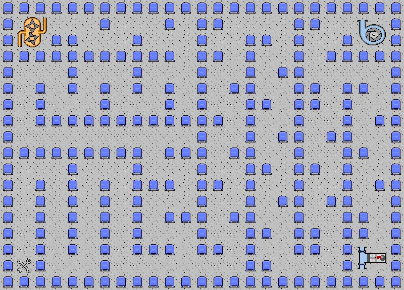

# Delta S+
*A Serious Game for mechanical technicians*

For now, only available in brazilian portuguese.

## Game Goal

- Move the wrenchs to the positive displacement pump(s).

## Game Rules

- You use the mouse to move the wrenchs. Click and hold the left mouse button on them and drag them to move them;

- Drop the wrenchs on the pump to choose it (in the same way, you can also undo the choice);

- After selecting the bomb(s) that you consider the right, press " Enter" (or "Return") on your keyboard to confirm the answer. If the answer is wrong, you lose the game, else, you win;

- If the wrenchs touch the pressure vessels, you lose.

## License

Read about license rights and limitations [here](LICENSE).
